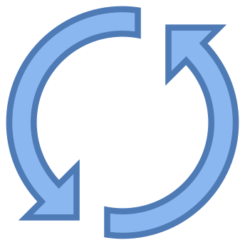

# Greenlab-Challenge       
## Preview       
[Demo ](https://drive.google.com/file/d/11SMlCCuraowYi7QtERldPtLFl3TP0B9Y/view?usp=sharing) 
<br>
[Want To Try!](https://greenlab-challenge.vercel.app/) 
## Libraries 
- [zikojs](https://github.com/zakarialaoui10/ziko.js) 
- [threejs](https://threejs.org/) 
- [xlsxjs](https://www.npmjs.com/package/xlsx) 
- [htmltoimage](https://www.npmjs.com/package/html-to-image) 
- [jsPdf](https://www.npmjs.com/package/jspdf) 
- [express](https://expressjs.com/fr/) 
- [socket.io](https://socket.io/fr/) 
- [nodemailer](https://nodemailer.com/about/) 


## Features 
 - [x] Change font family & size and color
 - [X] Toggle Dark/Light Mode
 - [x] store settings in Local storage (styles & positions)
 - [x] Upload Background 
 - [x] Export Data from Excel File 
 - [x] Orbit and transform control 
 - [x] Preview of generated Attestations
 - [x] Download Attestations as pdf file 
 - [x] Send Attestations via Email  

## Index
<table>
 <tr>
  <td></td>
  <td>Refresh</td>
 </tr>
 <tr>
  <td></td>
  <td>Reset settings</td>
 </tr>
 <tr>
  <td></td>
  <td>help</td>
 </tr>
 <tr>
  <td></td>
  <td>Toggle Dark/Light Mode</td>
 </tr>
</table>

## Limitations
To send attestaions via Email we need real-time communication between the client and the server,I use socket.io library to reach this communication ,on the other hand Serverless Functions on Vercel are stateless and have a maximum execution duration.
As a result, it is not possible to maintain a WebSocket connection to a Serverless Function.

## Want to try localy


<ol>
 <li>Install any IDE (I Recommand Vs Code)</li>
 <li>Install Node.js</li>
 <li>Clone this repository</li>
 <li></li>
</ol>


```
gh repo clone zakarialaoui10/Greenlab-Challenge
```


## License
[MIT](https://choosealicense.com/licenses/mit/)

